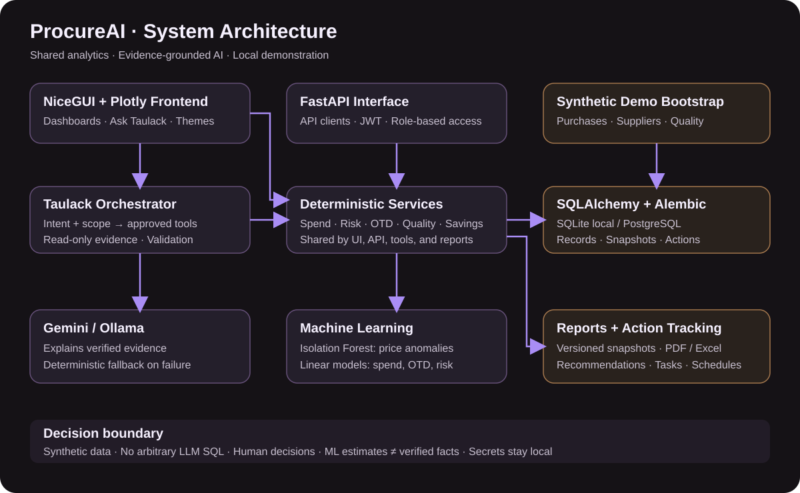
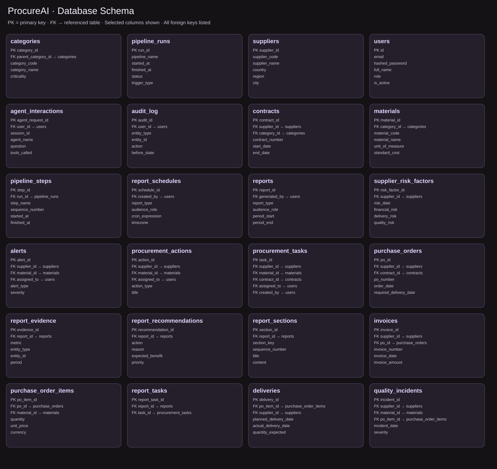

# ProcureAI

AI-Powered Procurement Intelligence & Supplier Risk Control Tower

ProcureAI turns procurement records into actionable dashboards, supplier investigations,
cost-saving opportunities, machine-learning projections, and professional reports.
**Ask Taulack** provides conversational procurement answers grounded in database evidence.

Developed by **Mirza Shaheen Iqubal**. All demonstration data is synthetic.

## What it does

| Area | Capabilities |
| --- | --- |
| Executive dashboard | Portfolio spend, delivery performance, savings opportunities, critical exposure |
| Procurement operations | Purchase activity, exceptions, searchable and sortable tables |
| Supplier intelligence | Performance, concentration, risk scores, supplier investigations |
| Spend, cost & value | Category spending, pricing anomalies, savings candidates |
| Delivery & quality | On-time delivery, delays, defects, performance trends |
| Risk & sourcing | Prioritized exposure and alternative sourcing candidates |
| Projections | ML-based spend, delivery, and supplier-risk outlook charts |
| Ask Taulack | Question-specific explanations, supporting evidence, follow-up suggestions |
| Reports | Versioned snapshots and PDF/Excel exports |
| Local pipeline | Connected synthetic data and local model training |

The interface includes light-lavender and dark themes, labeled interactive charts, focused
KPI cards, and a floating Ask Taulack assistant.

## System architecture



The NiceGUI frontend and FastAPI interface share Python services and SQLAlchemy models.
The frontend currently calls services directly—it is not an API-only client. SQLite supports
local demonstrations; PostgreSQL is available for the container stack.

Deterministic services calculate official KPIs, scores, rankings, and financial values.
ML produces estimates and anomaly indicators. Ask Taulack retrieves evidence through approved
read-only tools, then Gemini or Ollama can explain it. The LLM cannot execute arbitrary SQL
or approve purchases.

### Ask Taulack workflow

1. Interpret the question and resolve supplier, metric, and time-period scope.
2. Route to supported, role-aware procurement tools.
3. Retrieve database-backed evidence through shared analytics services.
4. Generate and validate an explanation with the configured LLM.
5. Return supporting evidence; use a deterministic fallback if the provider fails.

Investigations cover supplier risk, supplier performance, cost and value, strategic sourcing,
and executive procurement. Answers are bounded by available data and tools.
See [AI agent architecture](docs/ai_agents.md).

## Database schema



The image is generated from the actual SQLAlchemy models. Each FK arrow identifies its
referenced table; selected business columns are shown to keep the diagram readable.
Suppliers connect to contracts and purchase orders; orders contain material lines, which
connect to deliveries and quality incidents. Invoices link to suppliers and orders. Risk
factors and alerts support monitoring. Users own actions, tasks, audits, and AI interactions.
Reports retain snapshots, sections, evidence, recommendations, and task links. Pipeline runs
contain step records. Categories support parent-child classification.

Regenerate the image with `python scripts/draw_schema.py` after changing the models.

## Procurement workflow: where ProcureAI fits

| Procurement step | How the app supports it | Boundary |
| --- | --- | --- |
| Identify needs | Material/category criticality and historical purchase analysis | Does not create or approve requisitions |
| Evaluate suppliers | Performance, risk, concentration, and supplier investigations | Human qualification remains necessary |
| Source and negotiate | Alternative candidates, price variance, savings opportunities | Does not run RFQs or negotiate contracts |
| Review contracts | Contract records and related procurement exposure | Not a legal review or signature platform |
| Monitor purchasing | Order values, materials, suppliers, and exceptions | Does not submit purchase orders to an ERP |
| Receive and inspect | Delivery timing, shortages, and quality incidents | Uses recorded data; does not perform inspections |
| Review invoices | Matching status, duplicate flags, and financial variance | Does not execute payments |
| Improve and govern | Reports, action/task tracking, ML outlooks, and AI explanations | Decisions and approvals stay with people |

ProcureAI is an intelligence and decision-support layer across procurement—not a replacement
for a transactional procure-to-pay ERP.

## User manual

1. **Start the local demo** using the commands below, then open the dashboard on port 8080.
2. **Review the executive dashboard** for the portfolio baseline and largest exceptions.
3. **Investigate operations and suppliers.** Use table keyword search to find matching cells;
   click sortable column headers to change ascending/descending order. Check filter scope
   before comparing values: some KPIs remain portfolio-wide.
4. **Explore cost, delivery, quality, and risk pages** to connect an exception with its supplier,
   material, financial impact, and performance history.
5. **Use strategic sourcing** to review alternative candidates. Treat rankings as investigation
   inputs rather than automatic supplier awards.
6. **Open Projections**, select the available horizon, and compare historical lines with ML
   estimates. A forecast is not an observed result or a guaranteed outcome.
7. **Open Ask Taulack** with the round bottom-right launcher. Ask a specific question, review
   its supporting evidence, and use stacked suggestions for follow-up. Close it with the close
   control or launcher when finished.
8. **Generate a report** from Reports, choose the available report/period options, then review
   the snapshot and download PDF or Excel. Review suggested actions before assigning tasks.
9. **Switch themes** with the header theme control for light or dark presentation.

### Ask Taulack: your procurement copilot

Ask Taulack combines conversational explanations with procurement-specific tools. It can
help investigate supplier risk, spending concentration, delivery performance, cost opportunities,
and sourcing alternatives. Include a supplier code, metric, or period for a precise investigation.
Conversational greetings do not need a procurement metric; analytical claims do need evidence.

For example, start with “Which suppliers have the highest risk?”, then investigate a named
supplier with “Why is supplier SUP-DE-014 risky?” Compare the answer with the supplier page
and inspect the scope and evidence before acting. A new question about a different entity
should explicitly name that entity rather than relying on ambiguous context.

AI generates explanations, not official numbers. Its ability to answer depends on supported
tools, available records, and the configured model. If Gemini quota or connectivity fails,
the app may return a grounded deterministic answer rather than a generated explanation.
Ask Taulack is not an unrestricted database shell and cannot make purchasing decisions.

### AI versus ML versus analytics

| Component | Purpose | Output |
| --- | --- | --- |
| Deterministic analytics | Calculate recorded procurement facts | KPIs, risk scores, rankings, financial values |
| ML | Detect unusual behavior and estimate future trends | Price anomaly indicators and projection series |
| Generative AI | Interpret questions and explain retrieved evidence | Natural-language investigation and recommendations |

Keeping these responsibilities separate makes explanations traceable without treating an
LLM response or a forecast as a verified historical fact.

## Technology stack

| Layer | Technology |
| --- | --- |
| Frontend | NiceGUI, Plotly, custom themes |
| API | FastAPI, JWT authentication, role-based access control |
| Database | SQLAlchemy, Alembic, SQLite / PostgreSQL |
| Analytics | Python, SQL, pandas, NumPy |
| Machine learning | scikit-learn: Isolation Forest and Linear Regression |
| AI explanations | Gemini or Ollama |
| Reporting | ReportLab PDF, openpyxl Excel |
| Testing | pytest, Ruff |

## Run locally

Python **3.12+** is required. Run commands from the repository root.

```bash
python -m venv .venv
source .venv/bin/activate
pip install -e '.[dev]'
cp .env.example .env
```

Windows activation: `.venv\Scripts\activate.bat` (cmd) or
`.venv\Scripts\Activate.ps1` (PowerShell).

For SQLite, set this in your local `.env`:

```dotenv
DATABASE_URL=sqlite:///./procureai.db
```

Initialize the schema, seed synthetic data, and train models:

```bash
alembic upgrade head
python scripts/bootstrap.py
python scripts/train_models.py
```

Start the API:

```bash
uvicorn apps.api.main:app --host 127.0.0.1 --port 8000 --reload
```

In a second terminal, activate the environment and start the frontend:

```bash
python apps/frontend/main.py
```

| Interface | Address |
| --- | --- |
| Dashboard | http://localhost:8080 |
| API documentation | http://localhost:8000/api/docs |
| Health | http://localhost:8000/health |
| Readiness | http://localhost:8000/ready |

For PostgreSQL, run `docker compose up -d postgres`, configure its `DATABASE_URL`, then
run migrations and bootstrap. `docker compose up --build` starts the containerized stack.
See the [local demo guide](docs/local_demo.md) for accounts and the demonstration story.

## Configure AI

Keep credentials in your local `.env`, never in source control.

```dotenv
LLM_PROVIDER=gemini
GEMINI_API_KEY=your_key_here
GEMINI_MODEL=your_supported_model_id
```

Alternatively, configure Ollama using [.env.example](.env.example). Provider credentials,
availability, and quota affect generated explanations; database analytics remain independent.

Example questions:

- Which suppliers have the highest risk?
- What is our on-time delivery performance?
- Which suppliers account for the most spend?
- Why is supplier SUP-DE-014 risky?
- Where can we reduce sourcing risk?

## Machine learning

**Isolation Forest** identifies unusual price behavior. **Linear Regression** fits historical
monthly series for spend, delivery performance, and supplier-risk outlooks. Projection charts
separate historical observations from forward estimates.

These are exploratory decision-support models, not calibrated guarantees. Review predictions
against data quality, business context, and validation before operational use.

## Quality checks

```bash
ruff check .
pytest
```

## Safety and current scope

- Data is synthetic; bootstrap is not a complete ERP ingestion integration.
- Official metrics are computed in Python or SQL, not invented by an LLM.
- APIs use JWT/RBAC; the local frontend demo identity is not a production login system.
- Some metrics remain portfolio-wide rather than responding to every page filter.
- Report schedules and scheduler-building support exist; production scheduling needs lifecycle setup.
- Production deployment, identity integration, monitoring, and stronger model validation remain
  separate work. This project is intended for local demonstration and development.
- Keep secrets, databases, generated reports, and model artifacts outside source control.

Further reading: [architecture](docs/architecture.md),
[procurement metrics](docs/procurement_metrics.md), [AI agents](docs/ai_agents.md).

## License

Licensed under the [MIT License](LICENSE).

---

Developed by Mirza Shaheen Iqubal
