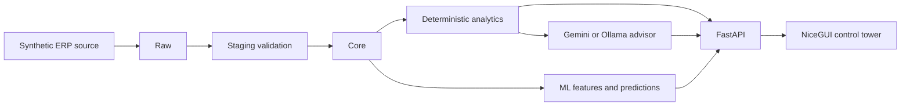

# ProcureAI

AI-powered procurement intelligence and supplier-risk control tower built with FastAPI,
NiceGUI, PostgreSQL, SQLAlchemy, deterministic analytics, scikit-learn, and replaceable LLM
providers. All demonstration data is synthetic. LLM output is advisory; official KPIs are
always calculated in Python or SQL.

## Quick start

Python 3.12+ is required.

```bash
python -m venv .venv
# macOS/Linux: source .venv/bin/activate
# Windows cmd: .venv\Scripts\activate.bat
# Windows PowerShell: .venv\Scripts\Activate.ps1
pip install -e '.[dev]'
cp .env.example .env
docker compose up -d postgres
alembic upgrade head
python scripts/bootstrap.py
uvicorn apps.api.main:app --reload
```

Open API docs at `http://localhost:8000/api/docs`, health at `/health`, and the NiceGUI
application at `http://localhost:8080`. Alternatively, `docker compose up --build` starts
the complete local stack.

## Architecture



The local demo includes populated executive, procurement, supplier, spend, cost, delivery,
quality, risk, sourcing, AI-advisor, pipeline and report pages; connected three-year synthetic
data; JWT/RBAC APIs; deterministic KPIs; price anomaly ML; and PDF/Excel output. See
[`docs/local_demo.md`](docs/local_demo.md) for accounts, commands and the prepared business story.

## Safety and limitations

- Demo mode is synthetic-only and disables unsafe production actions.
- Secrets belong in environment variables or Azure Key Vault, never source control.
- The current release is an incremental foundation; the roadmap in `docs/architecture.md`
  tracks the remaining domain entities, pipeline, ML, reports, and Azure modules.

## AI procurement agents

The Procurement Orchestrator routes investigations to Supplier Risk & Action, Supplier
Investigation, Cost & Value, Strategic Sourcing, or Executive Procurement agents. Agents call
only allow-listed RBAC-protected tools returning typed, period-aware evidence. Gemini interprets
that evidence; deterministic Python and SQL remain authoritative for every KPI, score, ranking,
and financial value. See [AI agent architecture](docs/ai_agents.md).

Licensed under the MIT License.
