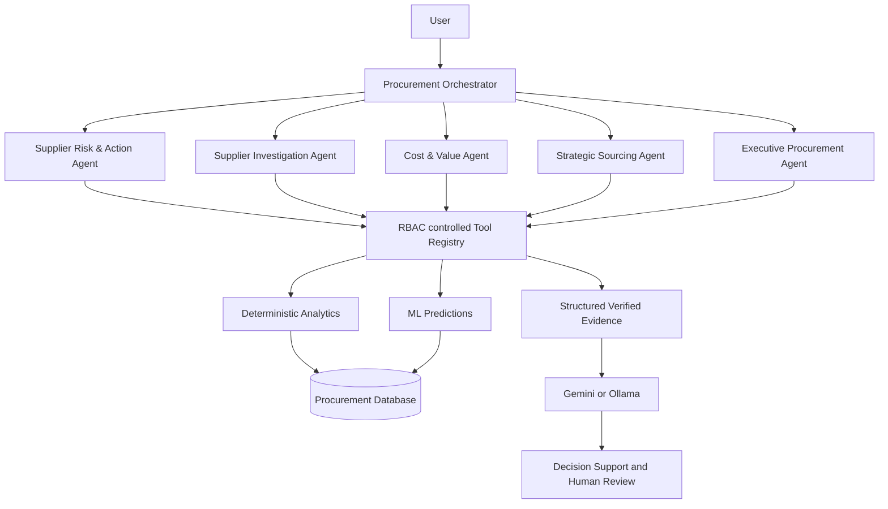

# AI procurement agents

ProcureAI agents connect procurement analytics to professional investigation and action. They
are not a generic chatbot or an autonomous purchasing system.

## Responsibilities

- **Supplier Risk & Action** identifies continuity, delivery, quality, dependency, contract,
  and financial exposure requiring attention.
- **Supplier Investigation** performs a period-aware supplier deep dive and explains drivers.
- **Cost & Value** explains deterministic price anomalies and savings opportunities.
- **Strategic Sourcing** explains the fixed ranking and trade-offs without approving suppliers.
- **Executive Procurement** limits output to management-level priorities.
- **Orchestrator** selects specialists using deterministic intent routing and never runs SQL.

## Controlled evidence

Every tool is allow-listed and checks the caller's role before calling an application service.
It returns the tool name, entity, data period, calculation timestamp, source, metric metadata,
and structured data. Responses keep verified data, ML predictions, AI interpretation, and
recommended actions as distinct fields.

## Guardrails and resilience

- Business text is passed as explicitly untrusted JSON, never appended to system instructions.
- Unsupported monetary values in Gemini output cause the narrative to be rejected.
- Provider failures return verified analytics and deterministic actions with a warning.
- Session memory retains at most five entity references in memory; conversations are not stored.
- Audits retain question, agent, tools, entity IDs, latency, provider/model and status—but no keys.
- Action cards create internal workflow records only after a human click.
- Switching `LLM_PROVIDER=ollama` preserves tools, evidence, routing, schemas and business rules.

## Demo workflows

1. `Why does SUP-DE-014 require attention?`
2. `Where is our largest current savings opportunity?`
3. `Find alternatives for MAT-0078.`
4. `What should procurement management focus on this month?`

ProcureAI does not use GenAI to replace procurement professionals. It combines deterministic
analytics, machine learning, supplier-quality intelligence and GenAI to identify risks, explain
their business impact and help professionals determine appropriate next actions.
